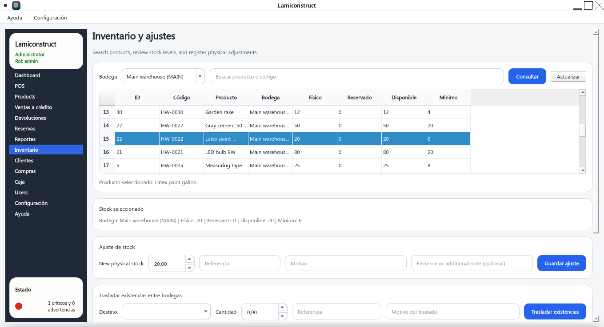
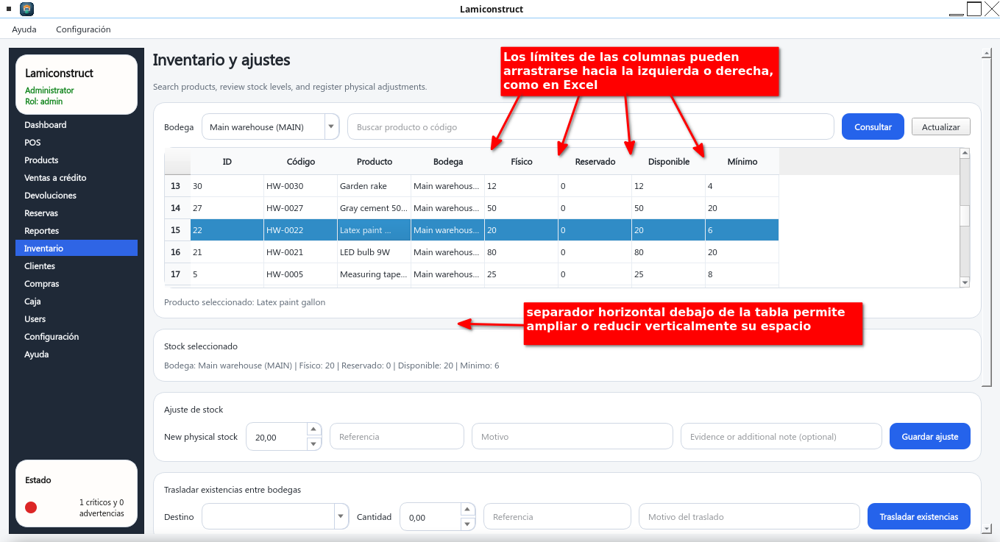

# partes-de-una-interfaz-grafica

De la siguiente interfaz gráfica:

están las siguientes partes:

  - El separador horizontal debajo de la tabla permite ampliar o reducir verticalmente su espacio.
  - Los límites de las columnas pueden arrastrarse hacia la izquierda o derecha, como en Excel

